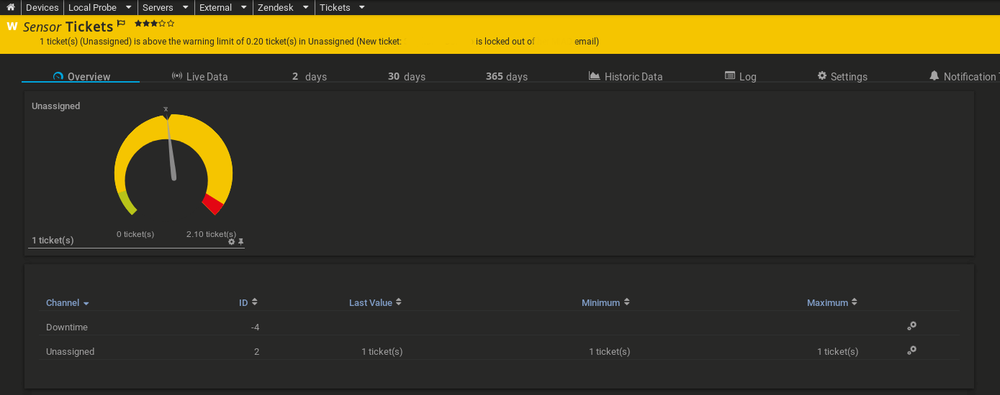

# Zendesk Notifications for PRTG
Get PRTG notifications when new / unassigned tickets are detected.



**Pre-requisites:**
- Linux-based server to run the Python script.  May work running from PRTG/probe machine, but since I prefer to administer my scripting environment with Linux, this was only tested on a Debian machine.

**How it Works**
- The Python script (zendesk_notifier) gets ran on a schedule and checks your Zendesk account for new / unassigned tickets.  When a condition is met (new / unassigned tickets), it sends a hook to PRTG and an alert notification gets pushed to your PRTG dashboard.


### Dependencies (required!)
**requests** - You can obtain it from apt (Debian/Ubuntu) or Pip/pip3 (any environment)

Debian/Ubuntu: `sudo apt update && apt install python3-requests`

Any: `pip3 install requests` (no root/sudo) - if you don't yet have pip, install it. (Installation varies by operating system type)


**Preliminary Setup**

Get your Zendesk API token, so you aren't hardcoding a password in your script.

- Login to Zendesk
- Go to Admin (wheel icon) > Scroll to *Channels* > **API**
- *Make sure* **Token Access** is toggled to **ON/Enabled**
- Just beneath the toggle, there's a light-grey **+** -- click it
- For **API Token Description**, enter: `PRTG Unassigned Notification`
- Copy the API key just beneath that, it will be used in the script (and won't be displayed by Zendesk, again!)


## Setup
1. Add Zendesk as a Device Object, if you haven't already
> Devices > Add New Device > Enter your Zendesk subdomain URL

2. Once the device object is added, create a new sensor:
  - Click the + sign in the sensor box > Add Sensor > Search for  HTTP Push Data Advanced & populate options as follows:
    - 	**Sensor Name:** Tickets
    - 	**SSL Settings:** HTTPS
    - 	**SSL Port:** 5051
    - 	**Request Method:** POST
    - 	**Identification Token:** [Leave default, for now]
    - 	**No Incoming Data:** Ignore and keep last status (if you choose other options, you'll need to sync the cron frequency with the scanning frequency.. ignore is the easiest option!)
  - CREATE

3. Now, click on "Tickets" and click "Settings" just above - grab the Identification Token and put it in the script's config for **PRTG_TOKEN**

4. RUN **zendesk_notifier** via CLI: `/path/to/zendesk_notifier` or `./zendesk_notifier` (if your terminal is already focused in the git directory) to create the sensor

5. Go into the channel settings (click the wheel icons) and set your thresholds:
    - 	**Unit:** ticket(s)
    - 	**Scaling Multiplication:** 1
    - 	**Scaling Division:** 1
    - 	[x] Enable alerting based on limits
    - 	**Upper Error Limit:** 2
    - 	**Lower Warning Limit:** 0.2 *(It didn't register as a warning with 1 - not yet sure if its a bug with the script, or PRTG)*

6. Set up the cron on the Linux-based server; as a non-root user, run: `crontab -e` and add the following line:

```bash
*/5 7-19 * * 1-6 /usr/bin/python3 /path/to/zendesk-notifier/zendesk_notifier >/dev/null 2>&1
```
*Replace **/path/to/** with the location of *zendesk_notifier* and */usr/bin/python3* (the latter being identical on Linux-based machines) on your system.*

### Adjust the cron time to suit:
Ordered left to right in the crontab.
`*/5` = every 5 minutes

`7-19` = run between 7am and 7pm

`*` = every day of the month

`*` = every month

`1-6` = Monday - Saturday *(Sunday would be 0)*

***
### Testing
Run a curl command via CLI / a command-line interface:
```bash
curl https://YOUR_USERNAME.zendesk.com/api/v2/search.json?query=assignee:none \
-v -u youragent@example.com /token:fFdfjkrySdoFSFaufsd....MKfisUDYgsd
```
Replace the string/line after `token:` with *your* API token, obtained from your Zendesk admin.

***

### Customizing
If you want to pull tickets other than those that are unassigned, you can alter the search query.  Instead of `assignee:none`, pick another query from the [API documentation](https://developer.zendesk.com/rest_api/docs/support/search) and modify the script to suit your needs.

***

### Log Cleanup (optional)
Note that if you opt to run this every frequently, you may want to consider blocking cron (or the script) from /var/log/syslog, else you'll see such spamming:

> Jan 10 21:46:01 angela CRON[2331]: (angela) CMD (/usr/bin/python3 /home/angela/zendesk-notifier/zendesk_notifier)


If you want to simply direct cron messages to their own log and not delete them entirely (which is what my example below will do), specify so in `/etc/rsyslog.conf`

To squash this useless logging, you can run (optional):
```bash
pico /etc/rsyslog.conf
```
Find the line:
```bash
*.*;auth,authpriv.none             -/var/log/syslog
```

Append cron, like so:
```bash
*.*;cron,auth,authpriv.none             -/var/log/syslog
```
Restart rsyslog:
```bash
service rsyslog restart
```

### Troubleshooting
You can run the script manually via CLI by just running the path in the terminal.

You can also omit `>/dev/null 2>&1` from the cron to have the debug output sent to `/var/mail/youruser` or to your cron/system default email.
